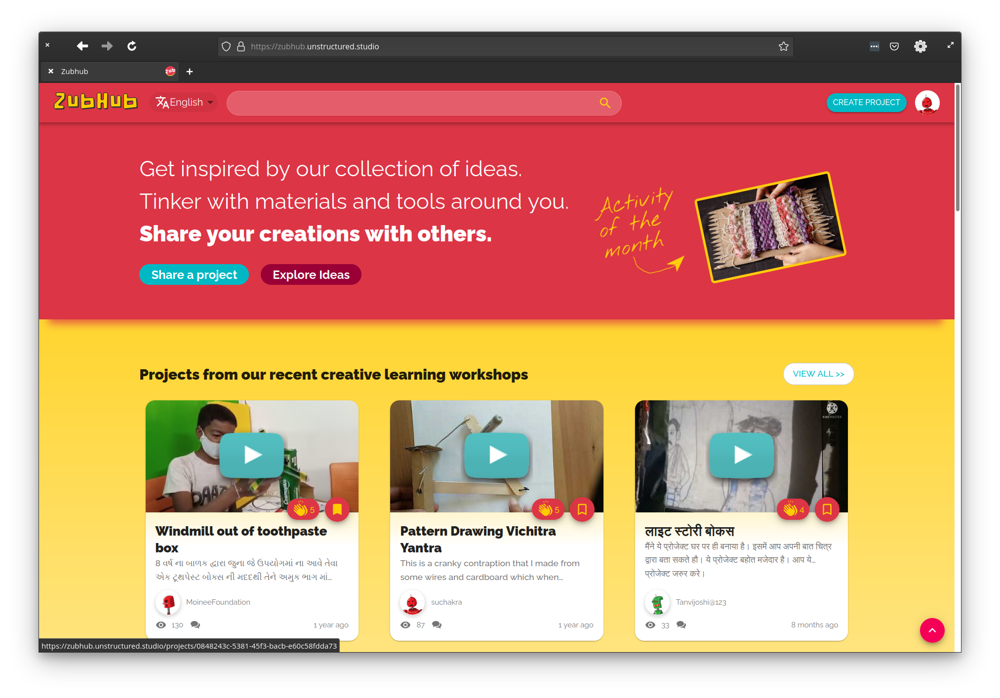

ZubHub is a free web platform that expands access to low-cost creative learning and collaboration opportunities globally to children in underserved communities.

It is available for custom use for your school, library, hackerspace, or educational organization. It can be hosted in low or no internet bandwidth locations to create a small virtual hub. These hubs can be interconnected to form an extensive distributed creative education network. You can think of it as [Mastodon](https://en.wikipedia.org/wiki/Mastodon_(software)) social network but specifically intended for showcasing and collaborating on creative educational projects. Or maybe like [Hackaday.io](https://hackaday.io/), but for children :smiley:  

| ZubHub is currently in public beta. A public ZubHub instance is hosted here: https://zubhub.unstructured.studio |
| --- |

Zubhub is designed and developed by [Unstructured Studio](https://unstructured.studio), an educational non-profit organization incorporated in Canada and India. Want to know more about ZubHub and our feature roadmap? Head to 👉 [ZubHub Wiki](https://github.com/unstructuredstudio/zubhub/wiki)!



# Development Setup
Follow the instructions below to set up your local development environment
## Steps

1. Install [Git](https://git-scm.com/downloads).\
   [jump to section](#install-git)
2. [Fork](https://github.com/unstructuredstudio/zubhub/fork) and clone zubhub repository.\
   [jump to section](#fork-and-clone-zubhub-repository)
3. Install [docker](https://docs.docker.com/get-docker/).\
   [jump to section](#install-docker)
4. Install [docker-compose](https://docs.docker.com/compose/install/).\
   [jump to section](#install-docker-compose)
5. Install [Node.js 14 and npm 7 or later](https://docs.npmjs.com/downloading-and-installing-node-js-and-npm/).\
   [jump to section](#install-node-and-npm)
6. Install make.\
   [jump to section](#install-make)
7. Setup Backend.\
   [jump to section](#setup-backend)
8. Setup Frontend.\
   [jump to section](#setup-frontend)

<br/>
<br/>

## Windows Specific Setup
- Install **Docker** and **Docker Compose** by installing [Docker Desktop for Windows](https://docs.docker.com/desktop/windows/install/).

- **Install tools (git, make, cygwin):**
The easiest way is to use a package manager like [Chocolatey](https://chocolatey.org/install). Follow the installation instructions for Windows Powershell (Admin), then run `choco install make git cygwin` to install all packages.
Follow the prompt requests allowing script execution. In the end, verify that packages are available with `make --version` and `git --version`, it should return a version for each command. Contributors also reported that installing [MozillaBuild](https://wiki.mozilla.org/MozillaBuild) automates the installation of a number of these tools.
At this point, you need to disable the config **core.autocrlf** before cloning the **zubhub** repository, otherwise, all files will use Windows line-endings (CRLF), and docker images will fail to build. To do so, open a Powershell as Admin (right-click on the Start Menu, select Windows Powershell (Admin)), and run:
```sh
git config --system --unset core.autocrlf
git config --global core.autocrlf false
```
You can use `git config -l` to verify that the value for **core.autocrlf** is correctly set.

<br/>
<br/>

## Install Git
> **_NOTE:_** You can skip this step if you already have **git** installed on your machine. To check if **git** is running on your machine, run the following command `git --version`.

1. click on this [link](https://git-scm.com/downloads), select your operating system from the options given, then download and install **git** on your local machine. 

<br/>
<br/>

## Fork and clone Zubhub repository

1. [fork](https://github.com/unstructuredstudio/zubhub/fork) the **zubhub** repository to your Github account.

2. On the homepage of the cloned repository in your own Github account, click on the **code** button, copy the URL in the dropdown then run the following code in your computer terminal:
 ```sh
       $ git clone <copied url>
 ```
 The copied URL will have the format of `https://github.com/<your github username>/zubhub.git`


<br/>
<br/>

## Install Docker
> **_NOTE:_** You can skip this step if you already have **docker** installed on your machine. To check if **docker** is running on your machine, run the following command `docker --version`.

1. Click on this [link](https://docs.docker.com/get-docker/), select your operating system from the options given, then download and install docker on your local machine. 

<br/>
<br/>

## Install Docker Compose
> **_NOTE:_** You can skip this step if you already have **docker-compose** installed on your machine. To check if **docker-compose** is running on your machine, run the following command `docker-compose --version`.

1. Click on this [link](https://docs.docker.com/compose/install/), go through the page and select your operating system from the options given, then follow the given instructions to download and install **docker-compose** on your local machine. 


<br/>
<br/>

## Install Node and NPM
> **_NOTE:_** You can skip this step if you already have **node** and **npm** installed on your machine. To check if **node** and **npm** are already installed on your machine, run the following command `node --version` and `npm --version`.

1. Click on this [link](https://docs.npmjs.com/downloading-and-installing-node-js-and-npm/) and follow the given instructions to install **node** and **npm** on your local machine.

<br/>
<br/>

## Install Make
> **_NOTE:_** You can skip this step if you already have **make** installed on your machine. To check if **make** is running on your machine, run the following command `make --version`.

* If you are on a Linux machine, you can install **make** through this [link](https://www.gnu.org/software/make/).
* If you are on a Mac machine, you can google the specific steps of installing **make** on a mac machine.
* If you are on a Windows machine, you should refer to the **Windows Specific Setup** section at the beginning of the **Developer Setup** section.


<br/>
<br/>

## Setup Backend
2. From the root of the repository, run:
```sh
       $ cd ./zubhub_backend
 ```
3. Run:

```sh
       $ make init
```
This will run all the initial setups required and start the server, generate the minimal **.env file** required to run the backend, spins-up all containers defined in the backend docker-compose file, applies all necessary migrations to the database, and creates a default admin user with username and password of **dummy** and **dummy_password** respectively.

In case you're facing issues after running the above, like make: Error,
kindly run this before the above command:

```sh
       $ docker-compose up
```

4. Run the server:

Subsequently, to start and stop the docker containers, you run the following

To start: 
```sh
       $ make start
```
To stop: 
```sh
       $ make stop or make down
```
For other make commands: run **make help**

Visit  http://localhost:8000 on your browser to access the API documentation.


<br/>
<br/>

## Setup Frontend
1. Create a file named **.env** in the frontend root folder (same directory with package.json)
2. Copy the content of **.env.example** and paste into the new .env file.
3. On your terminal/command line, navigate to **./zubhub/zubhub_frontend/zubhub** directory

### **Using npm**
This is advisable for a better development experience.

- Run `npm install` to install the dependencies.
- Run `npm start` to start the frontend.

### **Using the Docker Container**
Use this when you are done with making your changes and you want to test your code on the Docker container.

- Run `make start` to spin up the frontend container.

Visit **localhost:3000** on your browser to access the frontend.

<br/>
<br/>

# Deployment
ZubHub is currently deployed on its main website using Github Actions that act as our build and deployment tooling. If you are interested in deploying Zubhub on your VM for testing and hosting purposes, follow the [Single VM Deployment](single_vm_deployment) instructions.  

<br/>
<br/>

# Documentation
- [Architecture Overview](./zubhub_backend/zubhub/docs/overview.md)
- [Web Server](./zubhub_backend/zubhub/docs/web_container.md)
- [Media Server](./zubhub_backend/zubhub/docs/media_container.md)
- [Database and ER Diagram](./zubhub_backend/zubhub/docs/others.md)
- [Background Tasks](./zubhub_backend/zubhub/docs/others.md)
- [Reverse-Proxy](./zubhub_backend/zubhub/docs/others.md)


<br/>
<br/>

# Contributions
Contributions are welcome! We suggest you first go through the [Contribution Guidelines and Code of Conduct](CONTRIBUTING.md) and the [Feature Roadmap and Ideas](https://github.com/unstructuredstudio/zubhub/wiki/Feature-Roadmap-&-Ideas-2022) we have been working on. Search the Issues to see there are no duplicates or overlaps before filing new feature requests and bugs.  

> **_NOTE:_** If you are interested in the API documentation instead, you need to follow the [instructions](#setup-backend) above about running the backend on your local machine and afterward visit **localhost:8000** on your browser to view the API documentation.
