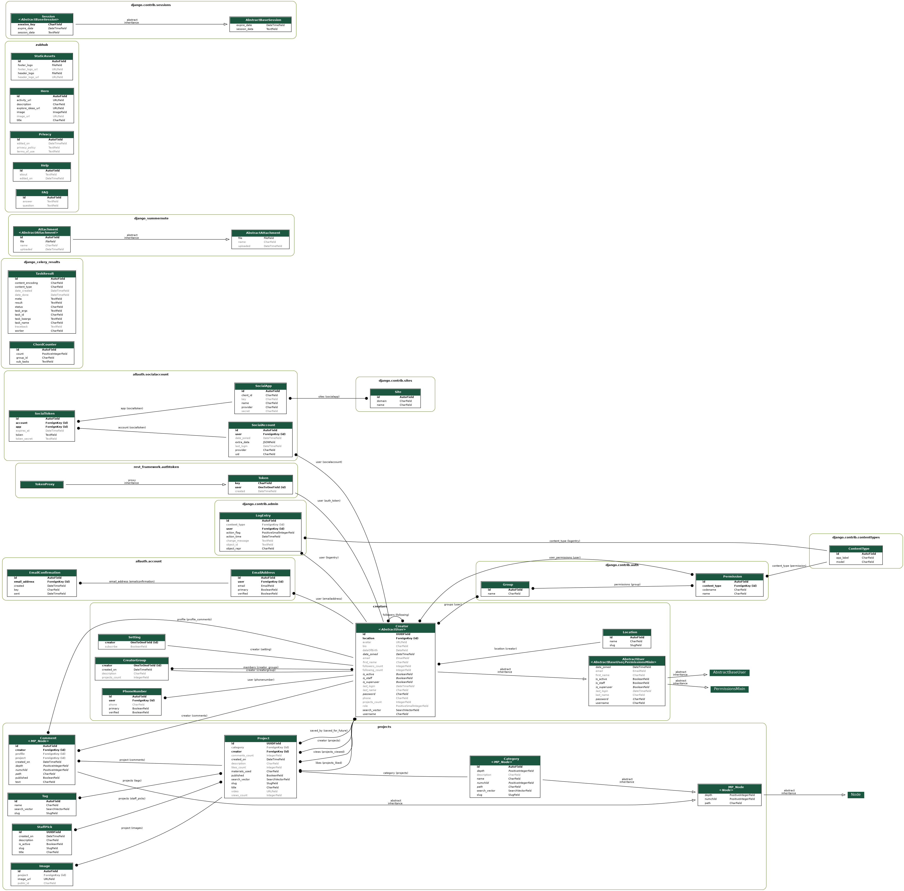

 
 
 
 

## Database Container

As the name suggests, this is where our SQL database runs. Containers like the web container and the celery container connect to this container to perform useful tasks.

The Diagram below is the entity-relationship diagram of every table in our database.

 
 
 
 

## RabbitMQ Container

This container runs our rabbitMQ message broker. the message broker serves as the link between the web container and the celery container, passing messages/jobs from our web container to the celery container where those jobs are performed.

 
 
 
 

## Celery Container

This container is used to run background tasks, like delete operations, sending notifications, periodic tasks, anything that should run in the application context

 
 
 
 

## Nginx Container

This is a custom Nginx container that serves as a reverse proxy for our backend in production. It handles request routing, SSL certificate generation, and auto-renewal.

 
 
 
 

---

 
 

On our Frontend, we run a minimum of one container in development and two in production.

## Frontend Container

Our frontend code lives on this container. When a user first makes a request to our domain, this container is responsible for serving the bundled assets required to run the frontend on their device.

 
 
 
 

<h2>Frontend Nginx Container</h2>

this container runs the same image as the Nginx container on our backend deployment. It serves the same purpose as the backend Nginx container but for the frontend this time.

 
 
 
 

---

 
 

Right now, our CI/CD process is based on Github actions and our deployment scripts can be found in the .github folder on the root folder. Generally, as a new contributor, you don't need to worry much about this folder because you generally won't be working on the deployment scripts.

The locust folder is where all the stress testing scripts live. This is used to stress-test our production app and profile the performance so we can see in real-time how our system performs under varying load conditions.
