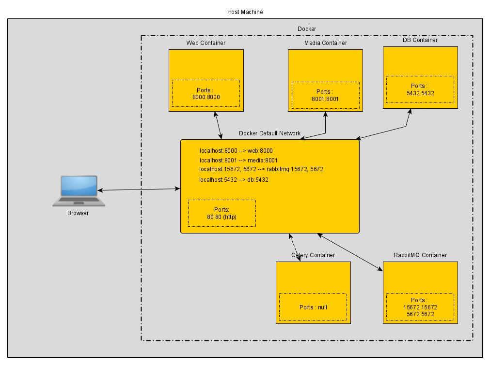

# Zubhub Developer Documentation

 
 

Our Infrastructure is built on docker and docker-compose and that makes it easy for us to manage the various issues that arise when development and deployment environments are different.

 

The backend consists of various components called services that need to work together to achieve the desired goal (database service, celery service, rabbitMQ service, media service, etc). Each service lives in its docker container and communicates with the other services through the inbuilt network provided by docker.

During deployment, we have two different server configurations, and the choice of which one to use depends on how we want the deployment to scale (horizontal or vertical). 

The diagram below is a bird' eye view of the configuration of the backend services on your local machine during development. (Note that the frontend container is missing from the diagram below. This diagram will be updated to represent that)

 
 

If the services are running in vertical scaling configuration in production, the diagram below is how the services communicate and talk with each other and the external world.

 
 

However if the services are running in the horizontal scaling configuration in production, the diagram below is how the services communicate and talk with each other and the external world.

 
 

---

 
 

On our backend, we run a minimum of Five containers in development and six containers in production. These containers are the bare minimum and if any is down, the backend either won't function as expected or won't function at all.

- Web Container
- Media Container
- Database Container
- RabbitMQ Container
- Celery Container

 
 
 
 